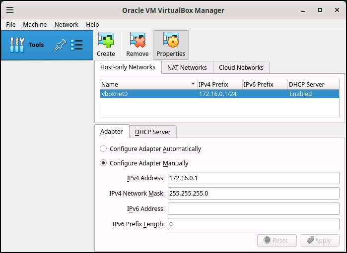

# HashiCorp Packer Builds for Rocky Linux

This is a Packer project to build Rocky Linux 9.4 Vagrant box on VirtualBox.

## Assumptions

This project assumes no existing installed software (listed below) and everything will be created from scratch.

## Requirements

The following software must be installed on your local machine before you can use Packer to build this Vagrant box:

  - [Packer](http://www.packer.io/)
  - [Vagrant](http://vagrantup.com/)
  - [VirtualBox](https://www.virtualbox.org/)
  - [Rocky Linux](https://rockylinux.org/)

Although not strictly necessary this is a recommended tree structure to get things going:

```bash
├── README.md
└── rocky94
    ├── http
    │   └── ks-rocky94.cfg
    ├── iso
    │   └── Rocky-9.4-x86_64-dvd.iso
    ├── output
    │   └── Rocky94.box
    ├── rocky94.pkr.hcl
    └── scripts
        ├── cleanup.sh
        ├── vagrant.sh
        └── virtualbox.sh
```
Unless you have a very fast Internet link I would suggest the Rocky Linux ISO is pre-downloaded prior to running.

## VirtualBox homelab setup

For the homelab setup on VirtualBox I recommend that a separate host-only network is setup so you can have a private network of VMs.
You will need to create a new host-only network - vboxnet0 - and create the IP range the network will use such as 172.16.0.0/24.
Also be sure to enable DHCP for the network to make things easy.

<div align="center">
  
</div>

## Post Install Scripts

  - **ks-rocky94.cfg** - This is the kickstart file for the VM build
  - **rocky94.pkr.hcl** - This is the main packer file
  - **cleanup.sh** - Cleanup script after the VM has been created
  - **vagrant.sh** - Setup the vagrant user
  - **virtualbox.sh** - Mount the VBoxGuestAdditions.iso

## Output

Once the packer build is complete the Vagrant box file will be saved to the **output** directory.

## Usage

Make sure all the required software (listed above) is installed, then cd into the **rocky94** directory and run:

    $ packer build -force -timestamp-ui rocky94.pkr.hcl

## Adding the Vagrant box file

You will need to add the box file to the Vagrant system before you can use it with Vagrant. Do the following:

    $ cd output
    $ vagrant box add Rocky94 Rocky94.box

## License

MIT

## Author

These configurations are maintained by F.Tao.
